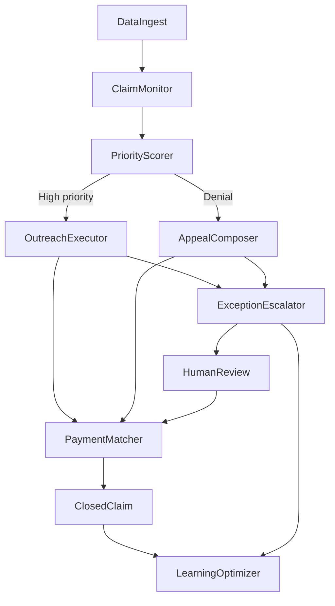
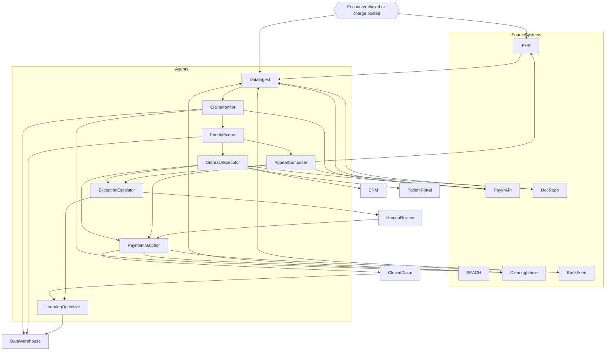

# Agentic Revenue-Cycle Accounts Receivable (AR) System for a Health & Life-Sciences Client

### Line-of-Business (LOB) systems and data to access
A. Electronic Health Record / Practice Management
• FHIR APIs or HL7 feeds for patient, encounter, charge, payer info
• CPT / ICD codes, service dates, claim identifiers

B. Claims Clearinghouse
• 837 claim submission files
• 835 electronic remittance advice (ERA) for payments & denials
• Claim status API

C. Payer Portals & Payer APIs
• Eligibility (270/271) and claim status (276/277) transactions
• Denial reason codes, appeal windows

D. Banking / Lockbox feeds
• BAI2 or 823 ACH addenda for deposits
• Check images, credit-card settlement files

E. Customer Relationship Management (CRM) / Call-Center
• Call logs, promise-to-pay notes, correspondence templates

F. Content & Document Management
• Scanned EOBs, medical records for appeals, signed consent forms

G. Enterprise Data Warehouse / BI
• Historical aging, payer trends, write-offs

H. Identity & Access / Audit Logs
• User roles, break-glass events for HIPAA compliance

Core agent actions required to achieve the business outcome
Agent 1 – DataIngestor
• Poll / subscribe to each LOB system
• Deduplicate, normalize codes, push to RCM data lake

Agent 2 – ClaimMonitor
• Detect claims unpaid > configurable days or with denial codes
• Flag missing documentation that will block payment

Agent 3 – PriorityScorer
• ML model outputs ExpectedRecoveryScore & UrgencyScore
• Populate work queues & next-best-action

Agent 4 – OutreachExecutor
• Auto-call payer API, send 276 request, parse 277 response
• If patient balance, trigger statement or SMS with payment link

Agent 5 – AppealComposer
• Read denial, summarize medical necessity from chart via LLM
• Draft appeal letter, attach evidence, route for signature

Agent 6 – PaymentMatcher
• Reconcile 835/BAI2 with open receivables, post cash, close claim

Agent 7 – ExceptionEscalator
• Identify edge cases (medical necessity, legal, >$10K)
• Route to human specialist with context bundle

Agent 8 – LearningOptimizer
• Capture outcome, retrain PriorityScorer & AppealComposer prompts

Human interaction model
• Daily Worklist Review: Supervisors approve queue logic, tweak thresholds.
• Appeal Approval: Clinician or compliance officer digitally signs appeal package.
• Complex Call Handling: Agent suggests script; human negotiates with payer when AI confidence < X%.
• Audit & Compliance: Random 5% of closed cases routed for human QA.
• Continuous Feedback: Users rate AI-generated notes/letters; ratings feed LearningOptimizer.

Thinking about the process flow
Business view

Identify aged or denied receivables.
Decide optimal recovery approach (payer follow-up, appeal, patient billing, write-off).
Execute actions quickly and consistently.
Secure payment, reconcile, and close.
Surface analytics for CFO: DSO, denial rate, recovery %.
Technical view
• Event-driven micro-services; each agent exposed as REST & message-bus consumers.
• Standardized healthcare data models: FHIR, X12, BAI2 schemas.
• Central metadata catalog for PHI with row-level masking.
• Idempotent endpoints—retry safe for at-least-once file arrivals.
• Observability: trace-IDs from EHR through cash posting.
• Governance: audit log, access policies in Keycloak / Okta.

Key value propositions
• 15-25% reduction in Days Sales Outstanding (DSO) through faster follow-up.
• 30-50% fewer manual touches per claim by automating status checks & appeals.
• 20% drop in denials converted to write-offs.
• Real-time AR visibility improves cash-flow forecasting and borrowing costs.
• Consistent compliance trail lowers audit risk and penalties.
• Scalable platform—extends to Pre-Authorization or Under-Payment use cases.

Mermaid JS diagram (no parenthesis in node or edge names)

Use this blueprint to drive discussions with IT, Compliance, and Revenue-Cycle leadership, then map each agent to specific APIs/endpoints in your client’s environment.


# Prompt 

```
this is great I need more detail in the diagram about the different tools or systems the specific agent might interact with
```

# Response

Below is an expanded Mermaid JS diagram that shows, for every agent, the principal external tools or systems it touches.
(Remember: no parentheses in any node names.)

``` mermaid
flowchart TD
  %% -------- Source & Target Systems --------
  subgraph SourceSystems
    EHR
    Clearinghouse
    PayerAPI
    BankFeed
    DocRepo
  end

  CRM
  PatientPortal
  DataWarehouse
  HumanReview
  ClosedClaim
  
  %% -------- Agent Layer --------
  subgraph Agents
    DataIngest
    ClaimMonitor
    PriorityScorer
    OutreachExecutor
    AppealComposer
    PaymentMatcher
    ExceptionEscalator
    LearningOptimizer
  end
  
  %% -------- Data Capture --------
  EHR --> DataIngest
  Clearinghouse --> DataIngest
  PayerAPI --> DataIngest
  BankFeed --> DataIngest
  DocRepo --> DataIngest
  
  %% -------- Core Flow --------
  DataIngest --> ClaimMonitor
  ClaimMonitor --> Clearinghouse
  ClaimMonitor --> PayerAPI
  ClaimMonitor --> DataWarehouse
  ClaimMonitor --> PriorityScorer
  
  PriorityScorer --> OutreachExecutor
  PriorityScorer --> AppealComposer
  PriorityScorer --> DataWarehouse
  
  %% -------- Outreach & Appeals --------
  OutreachExecutor --> PayerAPI
  OutreachExecutor --> CRM
  OutreachExecutor --> PatientPortal
  OutreachExecutor --> PaymentMatcher
  
  AppealComposer --> DocRepo
  AppealComposer --> EHR
  AppealComposer --> PaymentMatcher
  
  %% -------- Cash Application --------
  PaymentMatcher --> BankFeed
  PaymentMatcher --> Clearinghouse
  PaymentMatcher --> ClosedClaim
  
  %% -------- Exceptions & Learning --------
  OutreachExecutor --> ExceptionEscalator
  AppealComposer --> ExceptionEscalator
  ExceptionEscalator --> HumanReview
  HumanReview --> PaymentMatcher
  
  ClosedClaim --> LearningOptimizer
  ExceptionEscalator --> LearningOptimizer
  LearningOptimizer --> DataWarehouse
Legend
• SourceSystems: operational or third-party platforms where data originates or is deposited (EHR, Clearinghouse, BankFeed, etc.).
• Agents: autonomous services that perform targeted RCM tasks.
• CRM & PatientPortal: channels for patient‐side communications.
• DataWarehouse: enterprise analytics store that both feeds and learns from agents.
```

# Prompt

the diagram is not clear on the starting point can you help me with that ?

# Response

Below is a revised Mermaid JS diagram that makes the ENTRY POINT explicit and traces the flow step-by-step from that point forward.
(Remember—no parentheses in any node or edge names.)


How to read the diagram

EncounterClosed is the trigger event (e.g., clinician signs the note and charges are posted).
DataIngest gathers all upstream data from the EHR plus any clearinghouse, payer, banking, or document repositories.
The workflow then proceeds through each agent, with the diagram showing every external tool or system each agent touches.

# Prompt

to be clear these are AI agents that will run autonomously with some human in the loop

# Response
Absolutely—each “agent” in the diagram is meant to run as an autonomous AI micro-service.
Humans plug in only at well-defined, policy-driven checkpoints or when the AI flags low confidence, high dollar value, or regulatory risk.
Below you will find:

A. How autonomy vs. human-in-loop works for every agent
B. Updated Mermaid JS diagram that visually marks human touchpoints

A. Autonomy and human-in-loop logic per agent
DataIngest – Fully autonomous
• Monitors event queues, APIs, files; retries on failure.

ClaimMonitor – Autonomous with override
• Escalates to SupervisorApproval when unidentified denial codes appear.

PriorityScorer – Autonomous ML model
• Score threshold T1 routes item to OutreachExecutor or AppealComposer;
below threshold T1 → ExceptionEscalator.

OutreachExecutor – Autonomous for routine payer API calls and patient messaging
• If AI confidence < 80 % on payer response parsing OR patient balance > $5000 → HumanReview.

AppealComposer – Hybrid
• Draft automatically; always requires ClinicianSignature for medical-necessity appeals;
requires SupervisorApproval if template variance > 20 %.

PaymentMatcher – Fully autonomous cash posting;
• Sends ambiguous matches (>1 open claim, partial payment) to HumanReview.

ExceptionEscalator – By definition sends the case to humans (SupervisorApproval or HumanReview).

LearningOptimizer – Autonomous; masks PHI, retrains ML only on de-identified fields;
• Monthly governance meeting for model-drift review.

B. Updated Mermaid JS diagram
(no parentheses anywhere)

```mermaid
flowchart TD
  %% -------- ENTRY POINT --------
  EncounterClosed{{Encounter closed or charge posted}}
  
  %% -------- Source & Target Systems --------
  subgraph SourceSystems
    EHR
    Clearinghouse
    PayerAPI
    BankFeed
    DocRepo
  end

  CRM
  PatientPortal
  DataWarehouse
  
  %% -------- Human Nodes --------
  SupervisorApproval[[Supervisor approval]]
  ClinicianSignature[[Clinician signature]]
  HumanReview[[Human review queue]]
  ClosedClaim
  
  %% -------- AI Agent Layer --------
  subgraph AIAgents
    DataIngest
    ClaimMonitor
    PriorityScorer
    OutreachExecutor
    AppealComposer
    PaymentMatcher
    ExceptionEscalator
    LearningOptimizer
  end
  
  %% -------- FLOW FROM ENTRY POINT --------
  EncounterClosed --> EHR
  EncounterClosed --> DataIngest
  
  %% -------- Data Capture --------
  EHR --> DataIngest
  Clearinghouse --> DataIngest
  PayerAPI --> DataIngest
  BankFeed --> DataIngest
  DocRepo --> DataIngest
  
  %% -------- Core Flow --------
  DataIngest --> ClaimMonitor
  ClaimMonitor --> Clearinghouse
  ClaimMonitor --> PayerAPI
  ClaimMonitor --> DataWarehouse
  ClaimMonitor --> PriorityScorer
  
  PriorityScorer --> OutreachExecutor
  PriorityScorer --> AppealComposer
  PriorityScorer --> ExceptionEscalator
  PriorityScorer --> DataWarehouse
  
  %% -------- Outreach & Appeals --------
  OutreachExecutor --> PayerAPI
  OutreachExecutor --> CRM
  OutreachExecutor --> PatientPortal
  OutreachExecutor --> PaymentMatcher
  OutreachExecutor -->|Low confidence or high balance| HumanReview
  
  AppealComposer --> DocRepo
  AppealComposer --> EHR
  AppealComposer --> ClinicianSignature
  ClinicianSignature --> PaymentMatcher
  AppealComposer --> PaymentMatcher
  
  %% -------- Cash Application --------
  PaymentMatcher --> BankFeed
  PaymentMatcher --> Clearinghouse
  PaymentMatcher --> ClosedClaim
  PaymentMatcher -->|Ambiguous match| HumanReview
  
  %% -------- Exceptions & Approvals --------
  ExceptionEscalator --> SupervisorApproval
  SupervisorApproval --> PaymentMatcher
  ExceptionEscalator --> HumanReview
  
  %% -------- Learning Loop --------
  ClosedClaim --> LearningOptimizer
  ExceptionEscalator --> LearningOptimizer
  HumanReview --> LearningOptimizer
  LearningOptimizer --> DataWarehouse
Reading tips
• Nodes with double brackets [[ ]] are explicit human touchpoints.
• AIAgents subgraph contains fully autonomous micro-services.
• Dotted or labelled edges show the conditions that trigger human involvement.
```