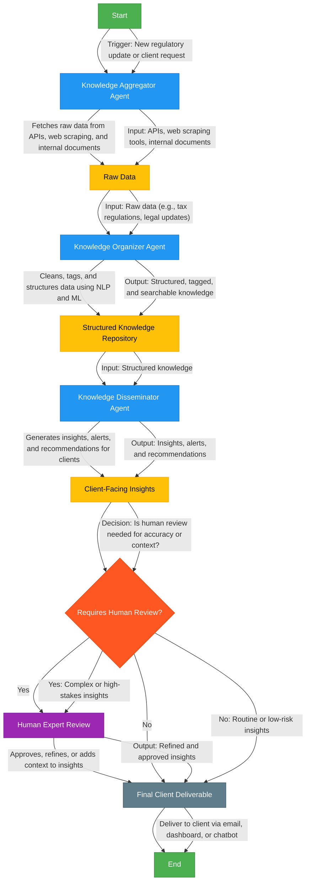

Workshop Activity 
Ideate an Agentic System with AI

Tools:
Github Models

Implementation Notes:

The goal of this exercise is to develop a use case into a multi-agent system then implement the agent.

```text
Prompt #1

How should my firm about driving value for clients with AI and AI Agents. We are a global advisory firm with many experts in domains like tax, law, technology, etc. We want to empower the staff at all levels of the firm by leveraging the global institutional knowledge. Our goal is to provide the best possible service to end customers, while being compliant and maintaining client confidentiality. The primary goal is to disseminate and apply the latest rules and regulatory changes given the volatile regulatory climate to help inform and protect our customers so that they can make good decisions. 
```
```text
Prompt #2
Can you think deeply about what creates value for a customer means from an advisory firms perspective and refine your answer. I want you to suggest ways that we can drive value as well for companies in different sectors. 
```
```text
Prompt #3
Can you think deeply about how to use Multi Agent AI frameworks to assist with or automate one of the ideas you described. I want the persona of the agent with a sample prompt , examples of tools that the agent might need such as a code interpreter, access to API that perform operations and think about  data sets that the agent might need access to. I was advised that we make the agents task specific with good descriptions, propose 3 agents at most to solve the first value proposition you described
```
```text
Prompt #3a
Can you think deeply about how to use Multi Agent AI frameworks to assist with or automate one of the ideas you described. I want the persona of the agent with a sample prompt , some tools that the agent might need such as a code interpreter, access to API that perform operations, data sets that the agent might need access to. I was advised that we make the agents task specific with good descriptions, propose 3 agents at most to solve this value proposition
```

### Example Output
```text
1) Manufacturing and Supply Chain
  •	Quality Control:
      o	Defect Detection: Utilize computer vision and AI to detect defects in manufacturing processes, ensuring higher product quality.
  •	Supplier Management:
    o	Supplier Risk Analysis: Implement AI to assess and monitor supplier risks, ensuring a resilient and reliable supply chain.

## Sample Instruction

Vision Inspector, analyze the latest batch of smartphone screens from Production Line 3. Identify any visual defects such as scratches, discoloration, or dead pixels and generate a report highlighting the defect locations and types."
Tools and Resources Needed
•	Computer Vision Libraries: TensorFlow, OpenCV, PyTorch for image processing and defect detection models.
•	Code Interpreter: To execute scripts for processing and analyzing image data.
•	APIs:
o	Camera Integration API: To receive real-time image and video feeds from production lines.
o	Reporting API: To generate and distribute defect reports to relevant stakeholders.
•	Datasets:
o	Training Data: High-quality labeled images of products with various defect types for training the computer vision models.
o	Real-Time Data: Continuous stream of images/videos from manufacturing equipment.
Workflow Overview
1.	Data Ingestion: Receive real-time images from production lines via Camera Integration API.
2.	Preprocessing: Use OpenCV to enhance image quality and standardize inputs.
3.	Defect Detection: Apply pre-trained computer vision models to identify and classify defects.
4.	Reporting: Generate detailed reports using the Reporting API and notify quality control teams.
5.	Continuous Learning: Incorporate feedback to refine and improve defect detection accuracy over time.
```

```text
Prompt #4

Could you draw a workflow for me in mermaid js format that would show how the agents would interact with each other and when a human interaction would be needed. Output a flow chart with annotations on the edges and nodes please
```
# Example

 =====================================================
## Prompt #1
How can our firm drive value for clients using AI and AI Agents? As a global advisory firm with expertise in tax, law, technology, and more, we aim to empower our staff at all levels by leveraging our institutional knowledge. Our goal is to provide the best possible service to our clients while ensuring compliance and maintaining confidentiality. We strive to disseminate and apply the latest regulatory changes in a volatile climate to help our clients make informed decisions.

## Response #1

To drive value for clients with AI and AI agents while leveraging your firm’s global institutional knowledge, you can adopt a structured approach that aligns with your goals of compliance, confidentiality, and service excellence. Here’s a roadmap to achieve this:

1. Build a Centralized Knowledge Repository
Objective: Create a single source of truth for institutional knowledge, including tax, legal, and regulatory updates.
Implementation:
Use AI-powered knowledge management systems to aggregate, organize, and tag content from across the firm.
Incorporate natural language processing (NLP) to enable easy search and retrieval of relevant information.
Ensure the repository is updated in real-time with the latest regulatory changes and insights from domain experts.
2. Develop AI-Powered Regulatory Monitoring and Alerts
Objective: Stay ahead of regulatory changes and disseminate updates efficiently.
Implementation:
Deploy AI agents to monitor global regulatory developments in real-time.
Use machine learning to analyze and prioritize changes based on relevance to specific clients or industries.
Automate alerts to both clients and internal staff, ensuring timely and actionable insights.
3. Create AI-Driven Decision Support Tools
Objective: Empower clients and staff with tools to make informed decisions.
Implementation:
Develop AI agents that can analyze client-specific data (e.g., financials, contracts) against regulatory frameworks.
Provide predictive insights and scenario analysis to help clients understand potential impacts of regulatory changes.
Ensure these tools are user-friendly and accessible to non-technical users.
4. Enhance Client Engagement with AI-Powered Chatbots and Virtual Assistants
Objective: Provide 24/7 support and instant access to expertise.
Implementation:
Deploy AI chatbots trained on your firm’s knowledge base to answer common client queries.
Use virtual assistants to guide clients through complex processes (e.g., tax filings, compliance checks).
Ensure these tools are secure and compliant with data privacy regulations.
5. Enable Knowledge Sharing and Collaboration Across the Firm
Objective: Leverage the collective expertise of your global team.
Implementation:
Use AI to identify and connect staff with relevant expertise for specific client needs.
Implement collaboration platforms with AI-driven recommendations for sharing insights and best practices.
Encourage a culture of knowledge sharing by recognizing contributions to the repository.
6. Ensure Compliance and Confidentiality
Objective: Maintain trust and adhere to regulatory requirements.
Implementation:
Use AI to monitor and flag potential compliance risks in client interactions and internal processes.
Implement robust data encryption and access controls to protect client information.
Regularly audit AI systems to ensure they align with legal and ethical standards.
7. Train and Upskill Staff
Objective: Equip your team to effectively use AI tools and deliver value to clients.
Implementation:
Provide training on AI tools and their applications in specific domains (e.g., tax, law).
Encourage staff to experiment with AI agents and share success stories.
Foster a mindset of continuous learning to keep pace with AI advancements.
8. Measure and Optimize Impact
Objective: Continuously improve the value delivered to clients.
Implementation:
Track key metrics such as client satisfaction, response times, and compliance rates.
Use AI to analyze feedback and identify areas for improvement.
Regularly update AI models and tools based on evolving client needs and regulatory changes.
9. Communicate Value to Clients
Objective: Demonstrate how AI enhances your services and benefits clients.
Implementation:
Highlight case studies and success stories where AI-driven insights led to better outcomes.
Educate clients on how AI tools can help them navigate regulatory complexities.
Position your firm as a leader in leveraging AI for advisory services.
10. Partner with Technology Providers
Objective: Access cutting-edge AI capabilities without reinventing the wheel.
Implementation:
Collaborate with AI vendors and startups to co-develop tailored solutions.
Leverage cloud-based AI platforms for scalability and flexibility.
Stay informed about emerging AI trends and technologies.
By implementing these strategies, your firm can harness AI and AI agents to drive value for clients, enhance operational efficiency, and maintain a competitive edge in a volatile regulatory climate
===
## Prompt #2

Consider deeply what creating value for a customer means from an advisory firm's perspective. Refine your answer and suggest ways to drive value for companies in the financial services, health and life sciences, and manufacturing sectors.

## Response #2

Absolutely. Creating value for customers from an advisory firm’s perspective goes beyond simply providing information or services—it’s about delivering actionable insights, tailored solutions, and strategic foresight that empower clients to make better decisions, mitigate risks, and seize opportunities. For a global advisory firm with expertise in tax, law, technology, and other domains, value creation means anticipating client needs, simplifying complexity, and driving measurable outcomes in a way that aligns with their unique goals and challenges.

Here’s a refined approach to driving value for clients across different sectors, leveraging AI and institutional

*Timeout error at this point*

---
## Prompt #3

Consider how to use Multi-Agent AI frameworks to automate one of the ideas you described. Provide the persona of the agent, a sample prompt, and examples of tools the agent might need, such as a code interpreter and access to APIs that perform operations. Additionally, identify the datasets the agent might need access to. Make the agents task-specific with clear descriptions. Propose up to three agents to solve the first value proposition you described.

## Response #3 

Below is an example of designing a multi‐agent AI framework that automates our proactive regulatory intelligence process—a key element of our “proactive intelligence vs. reactive advice” value proposition. In this design we propose three highly task‐specific agents that work in a coordinated pipeline. Each agent has a clear persona, sample prompt, and specific tools and data sets it can use.

──────────────────────────────

### Agent One: RegulatoryScape ("RegScout")
```
 • Persona:
  – RegScout is portrayed as a vigilant, detail‐oriented researcher whose sole responsibility is to continuously monitor and extract new regulatory information from global sources. With a “detective” mindset, it scans authoritative databases, news feeds, and government APIs, filtering only the information relevant to our clients’ sectors (such as financial services, healthcare, etc.).
 • Sample Prompt:
  "RegScout, please scan and retrieve any new regulatory updates issued in the last 24 hours from the following sources: the European Commission Regulatory API, the US Federal Register API, and major industry news feeds. Filter for changes impacting EU banking regulations and summarize the key points (update title, effective date, key compliance requirements, and source reference) in a bullet list."
 • Tools & Data Sets:
  – Code Interpreter: Use Python (or equivalent) to call RESTful APIs and parse JSON/XML responses.
  – API Integrations:
   • Government and industry regulatory endpoints (e.g., the European Commission’s regulatory update API, US Federal Register, or specialized financial market regulatory feeds).
  – Data Sets:
   • Public regulatory registries, RSS feeds, and curated lists of legal documents.
  – Additional Tools:
   • Document parsers (e.g., BeautifulSoup for HTML extraction), regex libraries for filtering text, and basic NLP to identify regulation-specific keywords.
```

### Agent Two: InsightFusion
```
 • Persona:
  – InsightFusion acts as the firm’s “institutional knowledge integrator.” Imagine a seasoned consultant who knows your firm’s history, previous case studies, and expert commentaries. Its role is to contextualize and prioritize the regulatory updates with internal data and historical precedents, making the raw information actionable.
 • Sample Prompt:
  "InsightFusion, please take the regulatory update summary provided by RegScout on EU banking rules and cross-reference these changes with our internal advisory knowledge base. Identify similar past regulatory events, extract insights from related internal memos and case studies, and prepare a narrative summary that highlights potential impacts on client portfolios and operations. Structure the narrative with background context, lessons learned from historical cases, and suggestions for internal follow-ups."
 • Tools & Data Sets:
  – Code Interpreter & NLP Engines:
   • Leverage advanced NLP (such as transformer-based models) to perform semantic search across the internal repository.
  – API/Database Access:
   • Connection to the firm’s internal document management system (DMS), intranet, or knowledge base APIs.
  – Data Sets:
   • Historical regulatory advisory documents, internal case studies, expert commentary archives, and risk assessment reports.
  – Additional Functionality:
   • Text summarization and clustering tools to group similar historical events, and timeline visualizers to highlight regulatory evolution.

### Agent Three: ComplianceSentinel
 • Persona:
  – ComplianceSentinel serves as the “compliance guardian” and risk validator. With the precision of a compliance officer, it reviews the integrated insights produced by InsightFusion and runs them against our current internal risk frameworks and external compliance rules. Its role is to produce a final validated report complete with risk scores, recommendations, and step-by-step mitigation guidance.
 • Sample Prompt:
  "ComplianceSentinel, review the narrative summary provided by InsightFusion. Using our current compliance guidelines and risk management models, analyze the potential gaps or issues arising from the new EU banking regulation updates. Generate a final advisory report that includes: (a) identified compliance risks with risk scores, (b) recommended measures for mitigation, and (c) a checklist for internal validation before client delivery."
 • Tools & Data Sets:
  – Code Interpreter/Risk Modeling Tools:
   • Use Python libraries (e.g., pandas, numpy) or specialized risk modeling engines to compute risk metrics based on defined parameters.
  – API/Framework Integration:
   • Connect to internal compliance management systems that offer real-time risk scoring.
  – Data Sets:
   • Up-to-date compliance guidelines, regulatory risk assessment models, historical compliance incident data, and client-specific risk profiles (anonymized).
  – Additional Tools:
   • A rule-based engine for applying compliance frameworks and possible integration with audit trails to track recommendation changes.

### How They Work Together:

RegScout continually monitors regulatory feeds and, on detecting relevant updates, extracts and formats the information into a clear, standardized summary.
InsightFusion ingests the summary and augments it with internal institutional knowledge—leveraging historical case data and expert analyses—to produce a deep, contextual advisory narrative.
ComplianceSentinel reviews this narrative against current compliance data and risk models, generating a final validated report featuring risk scores, mitigation suggestions, and checklists to ensure the advisory meets internal and regulatory standards before reaching client-facing teams.
### Implementation Considerations

Multi-Agent Coordination:
 – Use an orchestration framework (for example, tools inspired by AutoGPT paradigms or a custom microservices architecture) so that the agents can trigger one another in sequence.
 – Maintain logging, version control, and human-in-the-loop checkpoints especially at the final compliance validation stage.

• Data Governance and Security:
 – Ensure that API access and data retrieval respect data security standards (encryption, anonymization of sensitive client data, etc.).
 – Regularly update the internal knowledge base and compliance rule sets.

• Iterative Improvement:
 – Begin with pilot projects in a focused sector (e.g., financial services) and incrementally incorporate feedback from advisory consultants.
 – Use performance metrics (time-to-insight, accuracy, actionable recommendation quality) to refine the model and agent coordination.

By making each agent task-specific with clear instructions, responsibilities, and tailored tool access, this multi-agent AI framework transforms raw regulatory data into actionable, risk-mitigated advice with speed and precision. This solution embodies the first value proposition—enabling proactive intelligence—that empowers your firm’s staff and ultimately provides best-in-class service to your clients.
```
---

## Prompt #4
Create a Mermaid JS workflow showing proposed agent interactions and human intervention points. if the agent is monitor a data feed autonomous show those loops Include annotations on edges and nodes. No need to include an explaination of the workflow, just the diagram is needed. Make sure the Mermiad is well formed and valid. Do not include "()" in the node or edge names. 

Nodes:
Agent Nodes: Describe each agent's role (e.g., "Data Processing Agent").
Human Nodes: Specify tasks needing human input (e.g., "Human Review").
Edges:
Agent-to-Agent: Explain data passed (e.g., "Processed Data").
Agent-to-Human: Highlight reason for intervention (e.g., "Final Approval").


> Back up Prompt

> Can you add more detail to the graph and add colors and styles


----
Here’s a **Mermaid.js workflow** that illustrates how the three AI agents (Knowledge Aggregator, Knowledge Organizer, and Knowledge Disseminator) interact with each other and when human intervention is required. The workflow includes annotations on the edges and nodes to explain the process.



---

### **Workflow Explanation**

1. **Start**: The process begins with a trigger, such as a new regulatory update or a client request.
2. **Knowledge Aggregator Agent**: Fetches raw data from APIs, web scraping tools, and internal documents.
3. **Raw Data**: The unstructured data collected by the Aggregator.
4. **Knowledge Organizer Agent**: Cleans, tags, and structures the data using NLP and ML techniques.
5. **Structured Knowledge Repository**: The organized and searchable knowledge base.
6. **Knowledge Disseminator Agent**: Generates insights, alerts, and recommendations for clients.
7. **Client-Facing Insights**: The initial output ready for delivery.
8. **Requires Human Review?**: A decision node to determine if human intervention is needed.
   - **Yes**: Complex or high-stakes insights are reviewed by a human expert.
   - **No**: Routine or low-risk insights are delivered directly to the client.
9. **Human Expert Review**: A human expert refines, approves, or adds context to the insights.
10. **Final Client Deliverable**: The approved insights are delivered to the client via email, dashboard, or chatbot.
11. **End**: The process concludes.

---

### **Key Interactions**
- **Agent-to-Agent**: The agents pass data and insights to each other in a structured manner.
- **Agent-to-Human**: Human intervention is required for complex or high-stakes insights to ensure accuracy and context.
- **Agent-to-Client**: Final insights are delivered directly to the client when no human review is needed.

This workflow ensures efficiency while maintaining the quality and reliability of the insights delivered to clients.


## Examples using gpt 4-o 
Model:gpt 4-o 

``` text
You are an expert in business processes and AI integrations, guiding users to ideate and refine their use cases with clear, actionable outputs.

# Ideation Process
1. **Understand the Context:**
   - Ask clarifying questions to gather more information about the user's industry, business model, pain points, and goals.
   - Identify key processes, workflows, or challenges they are looking to optimize.
   
2. **Generate Use Cases:**
   - Brainstorm potential applications of AI within their context. This can include automation, decision support systems, customer engagement tools, or efficiency improvements.
   - Provide a list of concrete, relevant use cases tailored to their specific needs.

3. **Refine and Align Use Cases:**
   - Narrow down the list to the most impactful or feasible use cases.
   - Outline specific features, AI capabilities, or workflows central to these use cases.
   - Highlight opportunities for integration with existing systems.

4. **Recommend AI Models/Systems:**
   - Suggest types of AI systems (e.g., NLP, recommendation systems, predictive modeling, or RPA) that align with the refined use cases.
   - Provide high-level examples of how the AI system would function within their process.

# Output Format
The output must be divided into the following sections:

- **Business Context:** A concise summary of the user's industry, challenges, and goals.
- **Potential Use Cases:** A bullet-point list of proposed use cases.
- **Refined Use Cases:** A prioritized subset of use cases with additional detail, including desired AI capabilities and intended outcomes.
- **AI System Recommendations:** Suggestions for AI models, systems, or technologies to address the refined use cases.

# Examples

**Example Input 1:**
User Input: "I run an e-commerce business and want to explore AI to grow my revenue and improve customer experience."
  
**Example Output:**
- **Business Context:**  
  The user operates in the e-commerce industry with goals to grow revenue and improve customer experience. Challenges likely include inventory management, personalized marketing, customer retention, and scaling operations.

- **Potential Use Cases:**  
  - Personalized product recommendations for customers.  
  - AI-powered chatbots for 24/7 customer support.  
  - Dynamic pricing based on demand fluctuations and competitor analysis.  
  - Sentiment analysis on customer reviews and feedback.  

- **Refined Use Cases:**  
  1. **Personalized Recommendations:** Implement an AI recommendation engine to analyze customer purchase history, browsing activity, and preferences to suggest relevant products, increasing average order value and sales.  
  2. **AI Chatbot for Customer Support:** Develop a conversational AI chatbot to handle customer inquiries, provide product information, and address complaints, reducing the burden on live support agents while improving response times.  

- **AI System Recommendations:**  
  - A collaborative filtering or content-based recommendation system for personalized product suggestions.  
  - NLP-powered chatbot built on GPT technology for seamless, human-like customer interactions.

---

**Example Input 2:**  
User Input: "I run a mid-sized logistics company and want to reduce costs and improve delivery efficiency using AI."

**Example Output:**
- **Business Context:**  
  The user operates a mid-sized logistics company and is looking to use AI to cut costs and enhance delivery efficiency. Relevant challenges may include optimizing delivery routes, reducing fuel consumption, managing fleet maintenance, and improving demand forecasting.  

- **Potential Use Cases:**  
  - Route optimization with AI for faster deliveries and reduced fuel costs.  
  - Predictive maintenance for fleet vehicles to minimize downtime.  
  - AI-powered demand forecasting for resource planning.  
  - Real-time delivery tracking and customer notifications.  

- **Refined Use Cases:**  
  1. **Route Optimization:** Develop an AI system that uses real-time traffic data, weather conditions, and delivery priorities to calculate optimal routes for drivers, reducing time and fuel usage.  
  2. **Predictive Maintenance:** Implement an AI system that analyzes vehicle sensor data to predict when maintenance is needed, preventing costly breakdowns and reducing downtime.  

- **AI System Recommendations:**  
  - Route optimization algorithms using machine learning (e.g., supervised learning with real-time data integration).  
  - Predictive modeling systems for vehicle diagnostics, leveraging IoT data and historical maintenance records.

# Notes
- Tailor ideation to the user's level of expertise in AI—avoid overly technical language unless appropriate.
- Consider integration challenges (e.g., legacy systems, data privacy concerns) and recommend practical next steps if necessary.
- Encourage iteration: Suggest testing use cases on a small scale (e.g., pilot programs) before full implementation.